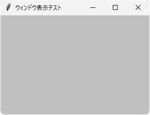

# tkinter.Tk
- アプリのメインウィンドウとなるクラス

## サンプル


```python
import tkinter

root = tkinter.Tk()
root.title('ウィンドウ表示テスト')       # タイトルバー
root.geometry('300x200+100+20')         # サイズと位置
root.maxsize(800, 600)                  # 最大サイズ
root.config(bg='#c0c0c0')               # 背景色
root.attributes('-topmost', True)       # 常に前面に表示
root.bind('<Double-Button-1>', print)   # マウス左ダブルクリック処理
root.bind('<Destroy>', print)           # ウィンドウが消滅時の処理
root.mainloop()
```

- まずコンストラクタ `Tk()` でウィンドウを作成する（この段階では非表示）
- `title()`、`geometry()` などのメソッドでウィンドウの諸元を設定する
- `bind()` で各種イベント処理を登録する
- `mainloop()` でウィンドウが表示され、マウス操作などが可能になる
- ウィンドウを閉じるとアプリは正常終了する

## メソッド一覧
- 詳細なメソッド一覧についてはこちら＞ [TkDocs / Tk](https://tkdocs.com/pyref/tk.html)

## コンストラクタ
- 普通は引数なしで呼び出せばよい

> 例： `root = tkinter.Tk()`

## title メソッド
- **title(タイトル文字列)**
- タイトルバーの文字列を指定する

## iconbitmap メソッド
- **iconbitmap(アイコンファイル名)**
- タイトルバーの左端にあるアイコン画像を指定する

## geometry メソッド
- **geometry(設定文字列)**
- 描画領域のサイズ（幅x高さ）や スクリーン上の位置（XY座標）を設定する
- 引数の形式は "幅x高さ+X座標+Y座標" とする（ピクセル単位）

> 例： `geometry("400x300+50+20")`

- X座標とY座標は省略可能で、その場合はOS規定の位置に配置される
- 座標はマイナス符号も可能で、下記の意味になる

    |符号指定|意味|
    |---|---|
    |＋X座標 |スクリーン左端からの距離|
    |－X座標 |スクリーン右端からの距離|
    |＋Y座標 |スクリーン上端からの距離|
    |－Y座標 |スクリーン下端からの距離|

## maxsize(width=幅, height=高さ)
- 描画領域サイズの上限を設定する（ピクセル単位）

## minsize(width=幅, height=高さ)
- 描画領域サイズの下限を設定する（ピクセル単位）

## resizable(width=真偽値, height=真偽値)
- 幅や高さの変更を許可(True)または禁止(False)する
- Windows で幅と高さをどちらも変更禁止すると、**最大化ボタンが無効** になる

## attributes(属性名1, 属性値1, ...)
- 次のようなウィンドウ属性を設定する（属性は他にもあるが省略）

    |属性名|意味|属性値|
    |---|---|---|
    |-alpha|不透明度|0.0=透明 ～ 1.0=不透明|
    |-topmost|常に前面表示|False=なし、True=あり|

- 引数は「 **"-属性名", 値** 」形式（名前に "-" が付くので注意）

> 例： `root.attributes("-alpha", 0.5)`

- 引数なしで呼び出すと、すべての属性をリスト形式で返す

## config(項目名1=設定値1, ...)
- `config()` は tkinter のどのクラスにもあり、各種設定用メソッドである
- クラスにより設定できる項目は異なる
- たとえば `Tk` クラスには次のような設定項目がある（他の項目もあるが省略）

    |項目名|意味|
    |---|---|
    |bg|背景色|
    |padx|左右のパディング（ピクセル単位）|
    |pady|上下のパディング（ピクセル単位）|
    |cursor|マウスカーソルの種類|

- 引数は「**名前付き引数 = 値**」形式

    > 例： `root.config(bg="#ccc")`

- 引数なしで呼び出すと、すべての設定を辞書形式で返す
- この辞書には項目の別名など、いろいろな情報が含まれるため、やや使いにくい
- 単に項目の値だけを知りたい場合は、次の `cget()` メソッドを使うとよい

## cget(項目名)
- `config()` の項目名を文字列で渡すと、その現在の値を返す

## bind(イベント名, 関数)
- イベントが発生すると、そのイベントを引数として関数を実行する、
- イベント処理については、別ページで詳しくまとめる（予定）

## mainloop()
- ウィンドウを表示してイベントループを開始する
- この時点から GUI 操作が可能になる

## update()
- ウィンドウを更新する（待機中の描画処理をすべて実行する）

## quit()
- 実行するとウィンドウを閉じてアプリを終了する
- このメソッドを使わずマウスでウィンドウを閉じてもよい
