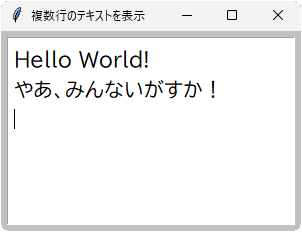

# tkinter.Text
- 複数行のテキストを表示したり編集できるクラス

## サンプル


```python
import tkinter

root = tkinter.Tk()
root.title('複数行のテキストを表示')
root.geometry('300x200+100+20')
root.minsize(250, 150)
root.config(bg='#c0c0c0', padx=6, pady=6)

textbox = tkinter.Text(root, font=('BIZ UDPゴシック', 15), padx=6, spacing1=10)
textbox.pack(side='top', expand=True, fill='both')
textbox.insert('end', 'Hello World!\n')
textbox.insert('end', 'やあ、みんないがすか！\n')
textbox.focus()

root.mainloop()
```

- コンストラクタ `Text()` の第１引数で親ウィンドウを指定
- コンストラクタ、または `config()` の `font` 引数でフォントを指定
- `insert()` でテキストを追加
- テキストはキーボードで編集もできる

## メソッド一覧
- メソッド一覧はこちら＞ [TkDocs / Text](https://tkdocs.com/pyref/text.html)

## コンストラクタ
- 第1引数で親ウィンドウを指定する

	例： `textbox = tkinter.Text(root)`

- 第2引数以降で、config() の項目も設定できる

	例： `textbox = tkinter.Text(root, padx=6, spacing1=4)`

## config メソッド
- **config(項目名1=設定値1, ...)**
<!-- -->
+ `Text` クラスのおもな設定項目

	| 項目名 | 意味 | デフォルト値 |
	|---|---|---|
	| foreground| 文字色 ( **fg** も可)| "SystemWindowText" |
	| background| 背景色 ( **bg** も可)| "SystemWindow" |
	| selectforeground | 選択エリアの文字色 | "SystemHighlightText" |
	| selectbackground | 選択エリアの背景色 | "SystemHighlight" |
	| padx | 左右のパディング| 1（ピクセル) |
	| pady | 上下のパディング| 1（ピクセル) |
	| spacing1 | 行の上の空白| 0（ピクセル) |
	| spacing2 | 文字間の空白| 0（ピクセル) |
	| spacing3 | 行の下の空白| 0（ピクセル) |
	| font | (名前, サイズ, スタイル) | 不明 |
	| state | "normal"： 変更可<br>"disabled"： 変更不可 | "normal" |
	| wrap | "char"： 文字で改行<br>"word"： 単語で改行<br>"none"： 自動改行なし | "char" |

<!-- -->
- `spacing2` は環境により無視される場合もある
<!-- -->
+ フォント名は、OS にインストールされたものが使える
+ たとえば "Arial", "BIZ UDPゴシック", "游ゴシック" など
+ 無効なフォント名の場合、"TkDefaultFont" になる
<!-- -->
- フォントサイズは、整数（ポイント単位）で指定する
- サイズ 0 は、デフォルトサイズになる
- デフォルトサイズは 13.5 ポイントに見えるが詳細は不明
<!-- -->
+ フォントスタイルは "bold", "italic", "underline", "overstrike" が有効
+ 複数のスタイルを並べて指定することもできる

	例： `font=("游ゴシック", 15, "bold", "italic")`

## cget メソッド
- **cget("項目名")**
- `config()` の項目名を文字列で渡すと、その現在の値を返す
- すべての項目名を得るには、`config().keys()` を列挙する

	例： `for i in tbox.config().keys(): print(i, ":", tbox.cget(i))`

## insert メソッド
- **insert(位置, 文字列)**
- 指定した位置に任意の文字列を追加する
- 文字列に改行コード "\n" を含めてもよい
<!-- -->
+ 位置は次の形式で指定する

	| 位置 | 意味 |
	|---|---|
	| "行位置.文字位置" | 整数で行位置と文字位置を指定する |
	| "1.0" | 上の記法で、テキスト全体の先頭は "1.0" になる |
	| "行位置.end" | 行末の改行位置は "end" で指定できる |
	| "end" | テキスト全体の末尾 |
	| "end-1c" | テキスト全体の末尾の直前の文字 |
	| "insert" | 現在のカーソル位置 |
	| "sel.first" | 選択領域の先頭 |
	| "sel.last" | 選択領域の末尾 |

## delete メソッド
- **delete(位置1, 位置2)**
- 位置1から位置2の直前までを削除する（位置2を含まない）
- 位置の指定方法は、上記 insert() メソッドと同じ

	例： 1行目の改行直前まで削除 `textbox.delete("1.0", "1.end")`   
	例： 1行目の改行ごと削除 `textbox.delete("1.0", "2.0")` 

## see メソッド
- **see(位置)**
- 指定した位置までスクロールする
- 位置の指定方法は、上記 insert() メソッドと同じ

	例： 1行目を見る： `textbox.see("1.0")`  
	例： 最終行を見る： `textbox.see("end")`

## count メソッド
- **count(位置1, 位置2, カウント対象)**
- 位置1から位置2までの範囲でカウント対象を数える（位置2を含む）

	| カウント対象 | 意味 |
	|---|---|
	| "chars" | 文字数 |
	| "lines" | 行数 |

- テキスト末尾に見えない終端文字（EOF）があるものとして数える
- "chars" は、通常文字、改行コード、EOF を1文字として数える
- "lines" は、EOF を1行として数える
- EOF を含めたくない場合は、範囲を "end-1c" までとする

	例： EOFを除く行数： `textbox.count("1.0", "end-1c", "lines")`

## focus メソッド
- **focus()**
- フォーカスを得る
- `Text` の場合、フォーカスを得ると、文字カーソルが表示される

## update メソッド
- **update()**
- 画面を更新する（待機中の描画処理をすべて実行する）

