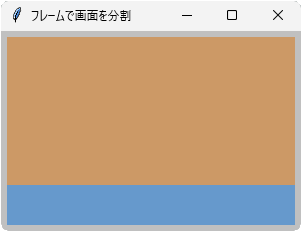

# tkinter.Frame
- ウィンドウ内に自由に配置できる「枠」のクラス
- 他の GUI パーツを置く土台にするとよい

## サンプル


```python
import tkinter

root = tkinter.Tk()
root.title('フレームで画面を分割')
root.geometry('300x200+100+20')
root.minsize(250, 150)
root.config(bg='#c0c0c0', padx=6, pady=6)

frame_a = tkinter.Frame(root, bg='#cc9966', width=80, height=80)
frame_a.pack(side='top', expand=True, fill='both')

frame_b = tkinter.Frame(root, bg='#6699cc', width=40, height=40)
frame_b.pack(side='top', expand=False, fill='x')

root.mainloop()
```

- コンストラクタで親ウィンドウを指定する
- 親ウィンドウ上で配置するには `pack()` メソッドを利用するのがオススメ
- `pack()` メソッドの引数 `side`、`expand`、`fill` の組み合わせで、いろいろな分割が可能
- 上記の例では、上部=高さ可変、下部=高さ固定になる

## コンストラクタ
- 第1引数で親ウィンドウを指定する
    > 例： `frame = tkinter.Frame(parent)`
- 第2引数以降で、config() の項目も設定できる
    > 例： `frame = tkinter.Frame(parent, bg='#cc9966')`

## おもなメソッド
- 詳細なメソッド一覧についてはこちら： **[TkDocs / Frame](https://tkdocs.com/pyref/frame.html)**

### config(項目名1=設定値1, ...)
- Frame クラスの config() のおもな設定項目を次に示す

|項目名|意味|
|---|---|
|bg|背景色|
|width|幅（ピクセル単位）|
|height|高さ（ピクセル単位）|
|bd|枠線の太さ（ピクセル単位）|
|relief|枠線タイプ（flat, groove, raised, ridge, solid, sunken）
|padx|左右のパディング（ピクセル単位）|
|pady|上下のパディング（ピクセル単位）|

- 引数なしで呼び出すと、すべての config 設定を辞書形式で返す
- 辞書データはさまざまな情報を含むので、やや扱いにくい
- 項目の値だけを知りたい場合は、次の cget() メソッドを使うとよい

### cget(項目名)
- config() の項目名を文字列で渡すと、その現在の値を返す

### pack(side=＊, expand=＊, fill=＊)
- フレームを積み重ねるイメージで配置する
- それぞれの引数の意味を次に示す

|side|意味|
|---|---|
|top|上辺に向けてフレームを積む|
|bottom|下辺に向けてフレームを積む|
|left|左辺に向けてフレームを積む|
|right|右辺に向けてフレームを積む|

- `side` 引数はフレームを積む方向を決める
- 異なる `side` を混在させてもよいが、すべて統一するとわかりやすい

|expand|意味|
|---|---|
|False|フレーム同士を密着させる|
|True|フレームをまばらに配置する|

- `expand` 引数はフレーム間の空白を指定する。
- `expand=True` のフレームがいくつもある場合、空白は均等割りされる。

|fill|意味|
|---|---|
|"none"|なにもしない|
|"x"|横いっぱいに広げる|
|"y"|縦いっぱいに広げる|
|"both"|縦横いっぱいに広げる|

- `fill` 引数は、`expand` で広げた空地を埋めるかどうかを決める。
- `fill="none"` にすると、`side` や `expand` の効果がわかりやすいので実験してみよう！
